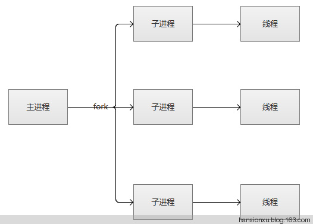
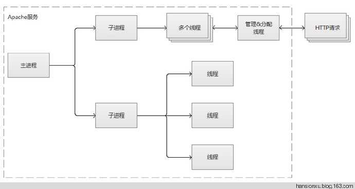

# apache 的模块与MPM模式

## 检查启用的 Apache 模块

Apache 基于模块化的理念而构建，这样就可以让 web 管理员添加不同的模块来扩展主要的功能及增强性能。列出或查看已经启用的 Apache 服务器启动了哪些模块，可以在运行运行如下命令来确认：

```
$ apache2ctl -t -D DUMP_MODULES   
或者 
$ apache2ctl -M
```

常见的 Apache 模块有：

* mod_ssl – 提供了 HTTPS 功能。
* mod_rewrite – 可以用正则表达式匹配 url 样式，并且使用 .htaccess 技巧来进行透明转发，或者提供 HTTP 状态码回应。
* mod_security – 用于保护 Apache 免于暴力破解或者 DDoS 攻击。
* mod_status - 用于监测 Apache 的负载及页面统计。

## Apache的三种MPM模式

一共有三种稳定的MPM（Multi-Processing Module，多进程处理模块）模式。它们分别是prefork，worker和event编译的时候，

* 可以通过configure的参数来指定：`--with-mpm=prefork|worker|event`
* 也可以编译为三种都支持，通过修改配置来更换 `--enable-mpms-shared=all`

大多数发行版apache2打包都选择以模块方式构建.

## debian系发行版切换MPM模式操作实例

由mpm_event切换mpm_prefork
```
cd /etc/apache2/mods-enabled
rm mpm_event.load mpm_event.conf
ln -sv ../mods-available/mpm_prefork.conf .
ln -sv ../mods-available/mpm_prefork.load .
```

## 三种MPM模式配置参考 

### prefork 模式


prefork模式可以算是很古老但是非常稳定的Apache模式。Apache在启动之初，就预先fork一些子进程，然后等待请求进来。之所以这样做，是为了减少频繁创建和销毁进程的开销。每个子进程只有一个线程，在一个时间点内，只能处理一个请求。

* 优点：成熟稳定，兼容所有新老模块。同时，不需要担心线程安全的问题。（我们常用的mod_php，PHP的拓展不需要支持线程安全）
* 缺点：一个进程相对占用更多的系统资源，消耗更多的内存。而且，它并不擅长处理高并发请求，在这种场景下，它会将请求放进队列中，一直等到有可用进程，请求才会被处理。

Apache的httpd.conf中的配置方式：

```
<IfModule mpm_prefork_module>
    StartServers             5
    MinSpareServers          5
    MaxSpareServers         10
    MaxRequestWorkers      250
    MaxConnectionsPerChild   0
</IfModule>
```

    # StartServers:　　        数量的服务器进程开始
    # MinSpareServers:　  　   最小数量的服务器进程,保存备用
    # MaxSpareServers:　　     最大数量的服务器进程,保存备用
    # MaxRequestWorkers:　　   最大数量的服务器进程允许开始
    # MaxConnectionsPerChild:　最大连接数的一个服务器进程服务

prefork 控制进程在最初建立“StartServers”个子进程后，为了满足MinSpareServers设置的需要创建一个进程，等待一秒钟，继续创建两 个，再等待一秒钟，继续创建四个……如此按指数级增加创建的进程数，最多达到每秒32个，直到满足MinSpareServers设置的值为止。这种模式 可以不必在请求到来时再产生新的进程，从而减小了系统开销以增加性能。MaxSpareServers设置了最大的空闲进程数，如果空闲进程数大于这个 值，Apache会自动kill掉一些多余进程。这个值不要设得过大，但如果设的值比MinSpareServers小，Apache会自动把其调整为 MinSpareServers+1。如果站点负载较大，可考虑同时加大MinSpareServers和MaxSpareServers。  

* MaxRequestsPerChild设置的是每个子进程可处理的请求数。每个子进程在处理了“MaxRequestsPerChild”个请求后将自 动销毁。0意味着无限，即子进程永不销毁。虽然缺省设为0可以使每个子进程处理更多的请求，但如果设成非零值也有两点重要的好处：
1. 可防止意外的内存泄 漏。
2. 在服务器负载下降的时侯会自动减少子进程数。
因此，可根据服务器的负载来调整这个值。

* MaxRequestWorkers指令集同时将服务请求的数量上的限制。任何连接尝试在MaxRequestWorkerslimit将通常被排队，最多若干基于上ListenBacklog指令。在apache2.3.13以前的版本MaxRequestWorkers被称为MaxClients 。

* MaxClients是这些指令中最为重要的一个，设定的是 Apache可以同时处理的请求，是对Apache性能影响最大的参数。其缺省值150是远远不够的，如果请求总数已达到这个值（可通过ps -ef|grep http|wc -l来确认），那么后面的请求就要排队，直到某个已处理请求完毕。这就是系统资源还剩下很多而HTTP访问却很慢的主要原因。虽然理论上这个值越大，可以 处理的请求就越多，但Apache默认的限制不能大于256。）

### worker 模式


worker模式比起上一个，是使用了多进程和多线程的混合模式。它也预先fork了几个子进程（数量比较少），然后每个子进程创建一些线程，同时包括一个监听线程。每个请求过来，会被分配到1个线程来服务。线程比起进程会更轻量，因为线程通常会共享父进程的内存空间，因此，内存的占用会减少一些。在高并发的场景下，因为比起prefork有更多的可用线程，表现会更优秀一些。有些人会觉得奇怪，那么这里为什么不完全使用多线程呢，还要引入多进程？
原因主要是需要考虑稳定性，如果一个线程异常挂了，会导致父进程连同其他正常的子线程都挂了（它们都是同一个进程下的）。为了防止这场异常场景出现，就不能全部使用线程，使用多个进程再加多线程，如果某个线程出现异常，受影响的只是Apache的一部分服务，而不是整个服务。

* 优点：占据更少的内存，高并发下表现更优秀。
* 缺点：必须考虑线程安全的问题，因为多个子线程是共享父进程的内存地址的。如果使用keep-alive的长连接方式，某个线程会一直被占据，也许中间几乎没有请求，需要一直等待到超时才会被释放。如果过多的线程，被这样占据，也会导致在高并发场景下的无服务线程可用。（该问题在prefork模式下，同样会发生）

注：keep-alive的长连接方式，是为了让下一次的socket通信复用之前创建的连接，从而，减少连接的创建和销毁的系统开销。保持连接，会让某个进程或者线程一直处于等待状态，即使没有数据过来。

```
<IfModule mpm_worker_module>
    StartServers             3
    MinSpareThreads         75
    MaxSpareThreads        250
    ThreadsPerChild         25
    MaxRequestWorkers      400
    MaxConnectionsPerChild   0
</IfModule>
```

    # StartServers:　　初始数量的服务器进程开始
    # MinSpareThreads:　　最小数量的工作线程,保存备用
    # MaxSpareThreads:　　最大数量的工作线程,保存备用
    # ThreadsPerChild:　　固定数量的工作线程在每个服务器进程
    # MaxRequestWorkers:　　最大数量的工作线程
    # MaxConnectionsPerChild:　　最大连接数的一个服务器进程服务

Worker 由主控制进程生成“StartServers”个子进程，每个子进程中包含固定的ThreadsPerChild线程数，各个线程独立地处理请求。同样， 为了不在请求到来时再生成线程，MinSpareThreads和MaxSpareThreads设置了最少和最多的空闲线程数；

* 而MaxRequestWorkers 设置了同时连入的clients最大总数。如果现有子进程中的线程总数不能满足负载，控制进程将派生新的子进程 
* MinSpareThreads和 MaxSpareThreads的最大缺省值分别是75和250。这两个参数对Apache的性能影响并不大，可以按照实际情况相应调节 。
* ThreadsPerChild是worker MPM中与性能相关最密切的指令。ThreadsPerChild的最大缺省值是64，如果负载较大，64也是不够的。这时要显式使用 ThreadLimit指令，它的最大缺省值是20000。 

Worker模式下所能同时处理的请求总数是由子进程总数乘以ThreadsPerChild 值决定的，应该大于等于MaxRequestWorkers。如果负载很大，现有的子进程数不能满足时，控制进程会派生新的子进程。默认最大的子进程总数是16，加大时 也需要显式声明ServerLimit（最大值是20000）。需要注意的是，如果显式声明了ServerLimit，那么它乘以 ThreadsPerChild的值必须大于等于MaxRequestWorkers，而且MaxRequestWorkers必须是ThreadsPerChild的整数倍，否则 Apache将会自动调节到一个相应值。
	
### event 模式

  

这个是Apache中最新的模式，在现在版本里的已经是稳定可用的模式。它和worker模式很像，最大的区别在于，它解决了keep-alive场景下，长期被占用的线程的资源浪费问题（某些线程因为被keep-alive，空挂在哪里等待，中间几乎没有请求过来，甚至等到超时）。event MPM中，会有一个专门的线程来管理这些keep-alive类型的线程，当有真实请求过来的时候，将请求传递给服务线程，执行完毕后，又允许它释放。这样增强了高并发场景下的请求处理能力。

event MPM在遇到某些不兼容的模块时，会失效，将会回退到worker模式，一个工作线程处理一个请求。官方自带的模块，全部是支持event MPM的。

    注意一点，event MPM需要Linux系统（Linux 2.6+）对EPoll的支持，才能启用。

还有，需要补充的是HTTPS的连接（SSL），它的运行模式仍然是类似worker的方式，线程会被一直占用，知道连接关闭。部分比较老的资料里，说event MPM不支持SSL，那个说法是几年前的说法，现在已经支持了。

Apache的httpd.conf中的配置方式：
```	
<IfModule mpm_event_module>
    StartServers             3
    MinSpareThreads         75
    MaxSpareThreads        250
    ThreadsPerChild         25
    MaxRequestWorkers      400
    MaxConnectionsPerChild   0
</IfModule>
```

    # StartServers:初始数量的服务器进程开始
    # MinSpareThreads:　　最小数量的工作线程,保存备用
    # MaxSpareThreads:　　最大数量的工作线程,保存备用
    # ThreadsPerChild:　　固定数量的工作线程在每个服务器进程
    # MaxRequestWorkers:　　最大数量的工作线程
    # MaxConnectionsPerChild:　　最大连接数的一个服务器进程服务

##  三种模式下，ab性能测试对比

常规满负载的场景下，并未发现有大的差异。

* 测试语句：
```
./ab -k -c 200 -n 200000 192.168.0.11/index.html
测试结果：
prefork：9556QPS
worker ：11038QPS
event ：10224QPS
```

* 测试语句：

```
./ab -k -c 200 -n 200000 192.168.0.11/index.php（echo "hello world";）
测试结果：
prefork：6094QPS
worker ：7411QPS
event ：7089QPS
```
	
就使用PHP而言，fastCGI和php-fpm是更推荐的使用模式。

现在的最新浏览器，在单个域名下的连接数变得越来越多（通常都是使用keep-alive），主流浏览器是2-6个（还有继续增长趋势，为了加快页面的并发下载速度）。高并发场景，会越来越成为Web系统的一种常态。Apache很成熟，同时也背负了比较重的历史代码和模块，因此，在Web系统比较方面，Nginx在不少场景下，表现比起Apache更为出色。

## 参考

* Apache的三种MPM模式比较：prefork，worker，event <http://blog.jobbole.com/91920/>
