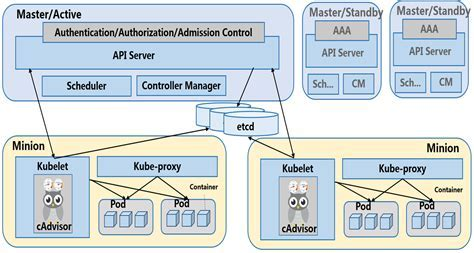

# 容器云方案部署文档

## 容器云概述


虚拟机和容器技术的实现了服务器计算环境的抽象和封装，可以作为服务器平台上的应用程序运行的软件实体。多台虚拟机和容器可以被部署在一台物理服务器上，或将多台服务器整合到较少数量的物理服务器上，但是容器技术不是为了完全取代传统虚拟机技术，两者有本质的区别：

* 虚拟机技术属于系统虚拟化，本质上就是在模拟一台真实的计算机资源，其中包括虚拟CPU,存储,以及各种虚拟硬件设备——这意味着它也拥有自己的完整访客操作系统;

* 容器技术则是应用虚拟化，使用沙箱机制虚拟出一个应用程序运行环境，每个运行的容器实例都能拥有自己独立的各种命名空间(亦即资源)包括: 进程, 文件系统, 网络, IPC , 主机名等;

虚拟机将整个操作系统运行在虚拟的硬件平台上, 进而提供完整的运行环境供应用程序运行,同时也需要消耗更过的宿主机硬件资源; 而Docker等容器化应用时使用的资源都是宿主机系统提供的,仅仅是在资源的使用上只是做了某种程度的隔离与限制.比起虚拟机,容器拥有更高的资源使用效率,实例规模更小、创建和迁移速度也更快.这意味相比于虚拟机,在相同的硬件设备当中,可以部署数量更多的容器实例，但是计算资源的隔离程度不如虚拟机，所以运行在同一台宿主机的实例更容易相互影响，甚至主机操作系统崩溃会直接影响运行在宿主机上的所有容器应用。

在实际生产场景中,需要面临众多跨主机的容器协同工作，需要支持各种类型的工作负载，并且要满足可靠性，扩展性，以及面临随着业务增长而要解决的性能问题,以及相关的网络、存储、集群，从容器到容器云的进化随之出现。 

构建一个容器云面临着众多的挑战，首先 Docker引擎的组网能力比较弱，在单一主机网络能提供较好的支持，但将Docker集群扩展到多台主机后，跨主机Docker容器之间的交互和网络的管理和维护将面临巨大的挑战，甚至难以为继，所幸很多公司都开发了各自的产品来解决这个问题，典型的如Calico, Flannel, Weave，包括docker1.9版本后提供的Docker Overlay Network支持，其核心思想就是在将不同主机上的容器连接到同一个虚拟网络，在这里我们选择了来自CoreOS的Flannel来作为集群网路解决方案。

在生产环境中，最终面向业务应用需要的容器数量庞大，容器应用间的依赖关系繁杂，如果完全依赖人工记录和配置这样的复杂的关联信息，并且要满足集群运行的部署，运行，监控，迁移，高可用等运维需求，实属力不从心，所以诞生了编排和部署的需求，能解决这类问题的工具有Swarm、Fleet、Kubernetes以及Mesos等，综合考虑从，最后悬着了来自Google的Kubernetes ---- 一个全径且全面的容器管理平台，具有弹性伸缩、垂直扩容、灰度升级、服务发现、服务编排、错误恢复及性能监测等功能，可以轻松满足众多业务应用的运行和维护。

容器云即以容器为资源分割和调度的基本单位，封装整个软件运行时环境，为开发者和系统管理员提供用于构建、发布和运行分布式应用的平台。最后用一张图示来概括整个容器的生态技术栈：


## 部署规划

参考上文图示,以四台机器为例做规划，一台主机做master，其他三台主机做node节点，所有主机部署centos7, 按照角色为每台主机命名:

| IP          |  主机名   |
|-------------|-----------|
| 10.1.10.101 |  master   |
| 10.1.10.102 |  node1    |
| 10.1.10.103 |  node2    |
| 10.1.10.104 |  node3    |

每台主机需要做的配置是：

* 关闭防火墙，禁用SElinux
* 配置软件源, 编辑文件 `/etc/yum.repos.d/CentOS-Base.repo`，完成如下修改：

```
[base]
name=CentOS-$releasever - Base - 163.com
baseurl=http://mirrors.163.com/centos/7.4.1708/os/x86_64/
gpgcheck=0
enabled=1

[extras]
name=CentOS-$releasever - Extras - 163.com
baseurl=http://mirrors.163.com/centos/7.4.1708/extras/x86_64/
gpgcheck=0
enabled=1

[k8s-1.8]
name=K8S 1.8
baseurl=http://mirrors.164.com/centos/7.4.1708/extras/x86_64/
gpgcheck=0
enabled=1
```

* 添加四台主机名的解析,可以修改/etc/hosts,添加如下配置:
```
10.1.10.101  master
10.1.10.102  node1
10.1.10.103  node2
10.1.10.104  node3
```
## docker集群部署与配置

首先要实现跨物理机的容器访问——是不同物理内的容器能够互相访问,四台机器，在master主机上部署etcd，三台机器安装flannel和docker。

|    主机     |    安装软件     |
|-------------|-----------------|
|   master    |      etcd       |
|   node1     | flannel、docker |
|   node2     | flannel、docker |
|   node3     | flannel、docker |

简单的说flannel做了三件事情：

1. 数据从源容器中发出后，经由所在主机的docker0虚拟网卡转发到flannel0虚拟网卡，这是个P2P的虚拟网卡，flanneld服务监听在网卡的另外一端。Flannel也是通过修改Node的路由表实现这个效果的。
2. 源主机的flanneld服务将原本的数据内容UDP封装后根据自己的路由表投递给目的节点的flanneld服务，数据到达以后被解包，然后直接进入目的节点的flannel0虚拟网卡，然后被转发到目的主机的docker0虚拟网卡，最后就像本机容器通信一样由docker0路由到达目标容器。
3. 使每个结点上的容器分配的地址不冲突。Flannel通过Etcd分配了每个节点可用的IP地址段后，再修改Docker的启动参数。“--bip=X.X.X.X/X”这个参数，它限制了所在节点容器获得的IP范围。

如上分所述，需要完成如下操作：

- 启动Etcd后台进程
- 在Etcd里添加Flannel的配置
- 启动Flanneld后台进程
- 配置Docker的启动参数
- 重启Docker后台进程

三个组件的启动顺序是: etcd->flanned->docker.

###  master主机的配置

1. 修改配置文件: /etc/etcd/etcd.conf, 参考修改如下(其中ip为master主机IP)：

```
ETCD_LISTEN_CLIENT_URLS="http://10.1.11.101:2379"
ETCD_ADVERTISE_CLIENT_URLS="http://10.1.11.101:2379"
```

* ETCD_LISTEN_CLIENT_URLS 对外提供服务的地址,客户端会连接到这里和 etcd 交互
* ETCD_ADVERTISE_CLIENT_URLS 告知客户端url, 也就是服务的url

2. 重新启动etcd服务，确认运行状态:
```
systemctl restart etcd
```

3. 确认修改无误后，添加和flannel相关的初始设置:

```
etcdctl -C http://10.1.11.101:2379 set /flannel/network/config '{"Network": "192.168.0.0/16"}'
```

### node 主机的配置

1. 修改flannel配置 /etc/sysconfig/flanneld， 参考如下修改：
```
FLANNEL_ETCD_ENDPOINTS="http://master:2379"
FLANNEL_OPTIONS='-etcd-prefix="/flannel/network"'
```

2. 修改 /lib/systemd/system/docker.service 在 [Service] 段内添加一行配置，也是让docker读取flanneld提供给docker的网路参数，参考修改如下:
```
EnvironmentFile=-/run/flannel/docker.env
```

3. 按照顺序重启服务
```
systemctl daemon-reload
systemctl restart flanneld
systemctl restart docker
```

4. 其他node节点主机做同样操作,最后在所有节点各自运行一个docker容器实例，查看各个容器间网络是否互通，如果一切顺利，跨物理机的容器集群网络配置完成。

## K8s的整体架构

Kubenetes整体架构如下图所示，主要包括apiserver、scheduler、controller-manager、kubelet、proxy。



- master端运行三个组件： 
* apiserver：kubernetes系统的入口，封装了核心对象的增删改查操作，以RESTFul接口方式提供给外部客户和内部组件调用。它维护的REST对象将持久化到etcd（一个分布式强一致性的key/value存储）。 
* scheduler：负责集群的资源调度，为新建的pod分配机器。 
* controller-manager：负责执行各种控制器，目前有两类：
  * endpoint-controller：定期关联service和pod(关联信息由endpoint对象维护)，保证service到pod的映射总是最新的。 
  * replication-controller：定期关联replicationController和pod，保证replicationController定义的复制数量与实际运行pod的数量总是一致。

- minion端运行两个组件：
* kubelet：负责管控docker容器，如启动/停止、监控运行状态等。它会定期从etcd获取分配到本机的pod，并根据pod信息启动或停止相应的容器。同时，它也会接收apiserver的HTTP请求，汇报pod的运行状态.
* proxy：负责为pod提供代理。它会定期从etcd获取所有的service，并根据service信息创建代理。当某个客户pod要访问其他pod时，访问请求会经过本机proxy做转发。 

## k8s部署和配置

在准备好快物理主机的集群网络后, 在master主机上安装kubernetes-master，其余三台节点主机安装kubernetes-node

|    主机     |    安装软件                                             |
|-------------|---------------------------------------------------------|
|   master    | kubernetes-master、kubernetes-common、kubernetes-client |
|   node1     | kubernetes-node、kubernetes-common                      |
|   node2     | kubernetes-node、kubernetes-common                      |
|   node3     | kubernetes-node、kubernetes-common                      |

集群架构

* master: 运行服务 apiserver, controllerManager, scheduler
* node1 : 运行服务 kubelet, proxy
* node2 : 运行服务 kubelet, proxy
* node3 : 运行服务 kubelet, proxy

### kubernetes的安全认证

基于CA签名的双向证书的生成过程如下：

1. 创建CA根证书

2. 为kube-apiserver生成一个证书，并用CA证书进行签名，设置启动参数

    根据k8s集群数量，分别为每个主机生成一个证书，并用CA证书进行签名，设置相应节点上的服务启动参数

* node3 : 运行服务 kubelet, proxy

生成证书
创建集群的root CA

生成CA、私钥、证书

   openssl req -x509 -nodes -days 365 -newkey rsa:2048 -keyout ca.key -out ca.crt -subj "/CN=k8s-master"  

   CA的CommonName 需要和运行kube-apiserver服务器的主机一直
创建apiServer的私钥、服务端证书

创建证书配置文件 /etc/kubernetes/openssl.cnf ，在alt_names里指定所有访问服务时会使用的目标域名和IP； 因为SSL/TLS协议要求服务器地址需与CA签署的服务器证书里的subjectAltName信息一致

[req]
req_extensions = v3_req
distinguished_name = req_distinguished_name
[req_distinguished_name]
[ v3_req ]
basicConstraints = CA:FALSE
keyUsage = nonRepudiation, digitalSignature, keyEncipherment
subjectAltName = @alt_names
[alt_names]
DNS.1 = kubernetes
DNS.2 = kubernetes.default
DNS.3 = kubernetes.default.svc
DNS.4 = kubernetes.default.svc.cluster.local
DNS.5 = localhost
DNS.6 = master
IP.1 = 127.0.0.1
IP.2 = 10.254.0.1
IP.3 = 10.1.10.238

最后两个IP分别是clusterIP取值范围里的第一个可用值、master机器的IP。 k8s会自动创建一个service和对应的endpoint，来为集群内的容器提供apiServer服务； service默认使用第一个可用的clusterIP作为虚拟IP，放置于default名称空间，名称为kubernetes，端口是443； openssl.cnf里的DNS1~4就是从容器里访问这个service时会使用到的域名。

创建分配给apiServer的私钥与证书

cd /etc/kubernetes/ca/
openssl genrsa -out server.key 2048
openssl req -new -key server.key -out server.csr -subj "/CN=k8s-master" -config ../openssl.cnf
openssl x509 -req -in server.csr -CA ca.crt -CAkey ca.key -CAcreateserial -out server.crt -days 9000 -extensions v3_req -extfile ../openssl.cnf

验证证书： openssl verify -CAfile ca.crt server.crt
创建访问apiServer的各个组件使用的客户端证书

for f in client node1 node2 node3  
do
    KEY_NAME=$f
    if [[ $KEY_NAME == client ]];then
      #HOST_NAME=k8s-master
      HOST_NAME=$KEY_NAME 
    else
      HOST_NAME=$KEY_NAME
    fi
      
    openssl genrsa -out $KEY_NAME.key 2048
    openssl req -new -key $KEY_NAME.key -out $KEY_NAME.csr -subj "/CN=$HOST_NAME"
    openssl x509 -req -days 9000 -in $KEY_NAME.csr -CA ca.crt -CAkey ca.key -CAcreateserial -out $KEY_NAME.crt 
done

注意设置CN(CommonName) 要在k8s集群中（client node1 node2 node3）域名解析生效

验证证书： openssl verify -CAfile ca.crt *.crt

### k8s-master的配置

### k8s-node的配置

### k8s操作和管理

